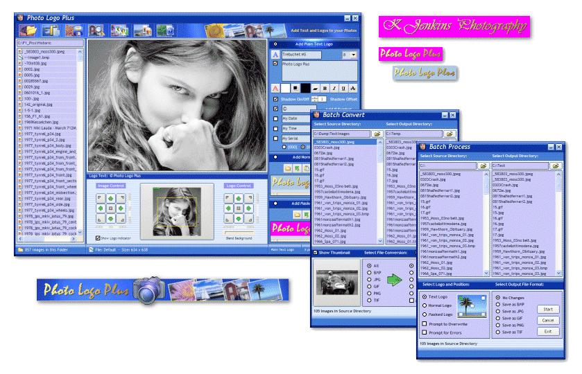



## Photo Logo Plus

### Description

Photo Logo Plus - Add Text, Date, Time, Serial Numbers, Image Logos, Masked Logos or copyright notices to your photos. Batch Process and Batch Conversion functions. Complete functioning application. Saves photos in BMP, JPG, GIF, PNG and TIF formats using GDI+. Ideal for photographers and people who want to publish photos on the internet. Converts from and to BMP, JPG, GIF, PNG and TIF. Including sample image logos and masked logos. Code includes error handling and logging routines. Lots of comments in the code, read the Help section available in the main menu.

Maintain the same directory structure when you unzip the files!

12-01-2009 - Some minor changes and optimisation of the code. Thanks to Roger Gilchrist for the tips.
 
### More Info
 

             |
---                |---
**Submitted On**   |2009-01-12 13:50:06
**By**             |[Berthold Bouman](https://github.com/Planet-Source-Code/PSCIndex/blob/master/ByAuthor/berthold-bouman.md)
**Level**          |Beginner
**User Rating**    |5.0 (104 globes from 21 users)
**Compatibility**  |VB 5\.0, VB 6\.0
**Category**       |[Complete Applications](https://github.com/Planet-Source-Code/PSCIndex/blob/master/ByCategory/complete-applications__1-27.md)
**World**          |[Visual Basic](https://github.com/Planet-Source-Code/PSCIndex/blob/master/ByWorld/visual-basic.md)
**Archive File**   |[Photo\_Logo2140411142009\.zip](https://github.com/Planet-Source-Code/berthold-bouman-photo-logo-plus__1-71596/archive/master.zip)

